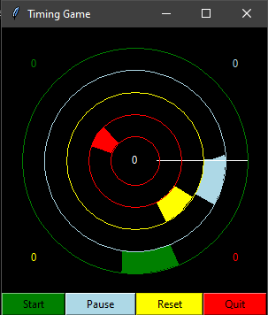

# timinggame
A small game I made when tinkering with tkinter

## Running the game
Run the game with `python timinggame.py`.
## Goal
Increase your central score (white) by hitting targets in the game rings (green, light blue, yellow, red). Hitting a target increases the score for that ring by 1, missing it decreases the score by 2. The larger the score for a ring, the smaller that target gets. Try to get the highest central score you can get!
## Controls
Start: Starts the game (or continues it if paused)\
Pause: Pauses the game\
Reset: Resets the game\
Quit: Quits the game

The A, S, D, and F keys control the green, light blue, yellow, and red rings, respectively. Press each key when the white cursor is over the respective ring target to gain points.
